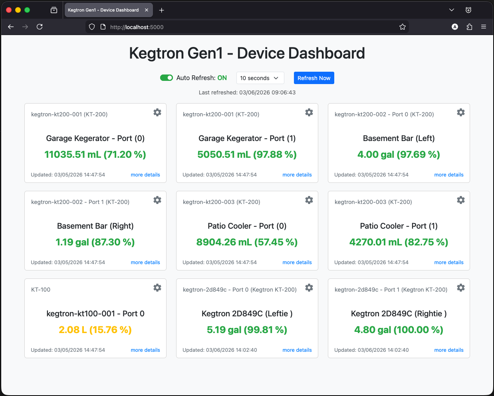
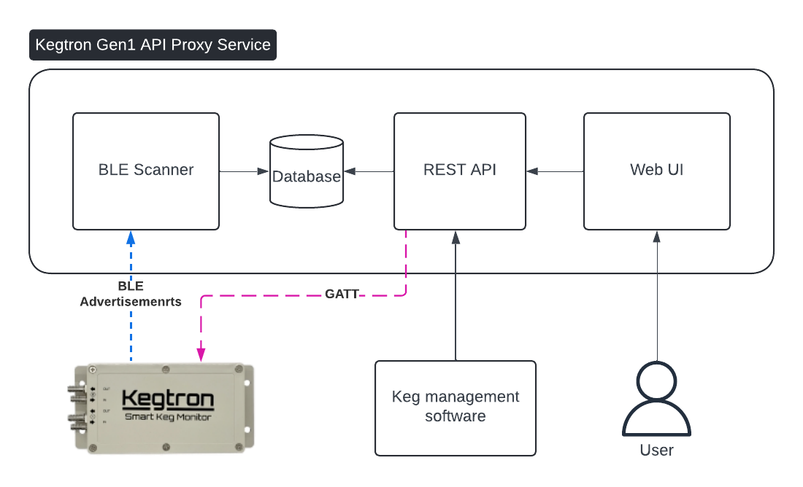

<div align="center">
  <picture>
    <source media="(prefers-color-scheme: dark)" srcset="./docs/img/logo%20-%20dark.png">
    <source media="(prefers-color-scheme: light)" srcset="./docs/img/logo%20-%20light.png">
    
  </picture>
  
  <h1 style="font-family: 'Roboto', -apple-system, BlinkMacSystemFont, 'Segoe UI', Helvetica, Arial, sans-serif;">Kegtron Gen1 API Proxy</h1>
</div>

The [Kegtron Gen1](https://kegtron.com/gen1/) is an BLE (bluetooth low energy) device that allows you track the amount of liquid that passes through it.  Specifically designed to track how much beer is dispensed through a tap.  However, its limitation is that it is bound to BLEs short distance radius.  Their app is excellent for managing these devices when you are within proximity, but if you manage multiple taps from a remote application, or manage from multiple locations, this does not work.  This API proxy aims to solve this problem.  This provides an HTTP(s) REST proxy so you can extend support for your devices.  The API aims to mirror the APIs for Kegtron's Pro devices so integration with both is simplified.  However, these devices are different so the APIs will differ slightly.



## Architecture



### Components

- **Host:** While this application is written in python, it relies one the [bleak](https://github.com/hbldh/bleak) module for the BLE communications.  Therefore must run on a supported operating system.  However, we have designed this specifically to run on a [Raspberry Pi](https://www.raspberrypi.com/) but should run perfectly fine on Blean supported OS.
- **BLE Scanner**: This sub-process actively scans BLE advertisement packets and filters for anything Kegtron specific.  Any changes on the device are stored in the database.  Updates are only stored when the device values change or the update cache window has passed.
- **REST API**: This service provides a RESTful API for external applications to pull for the state and execute commands to the device
- **Web UI**: Web interface allows for monitoring and configuration of the known devices using an modern web browser.

## Quick Start

### Prerequisites

- Python 3.11 or higher
- Poetry (for dependency management)
- Bluetooth LE capable hardware
- Make (for running build commands)

### Installation

1. **Clone the repository**

   ```bash
   git clone https://github.com/alanquillin/kegtron-gen1-api-proxy.git
   cd kegtron-gen1-api-proxy
   ```

2. **Install dependencies**

   ```bash
   make depends
   ```

   This will install all required Python packages using Poetry.

3. **Run the application**

   ```bash
   make run-local
   ```

   This will:
   - Run database migrations
   - Start the API server on port 8080
   - Begin scanning for Kegtron devices

### Running in Debug Mode

For troubleshooting, you can run the application with debug logging enabled:

```bash
# Run API server with debug logging
make run-dev-local

# Or run BLE scanner as a standalone service with debug logging  
make scan-dev
```

The debug mode provides verbose logging output that can help with:

- Troubleshooting connection issues
- Understanding BLE packet data
- Monitoring API requests and responses
- Debugging database operations

### Accessing the Application

Once running, you can access:

- **Web UI**: http://localhost:8080
- **API Documentation**: http://localhost:8080/api/docs
- **Health Check**: http://localhost:8080/api/v1/health
