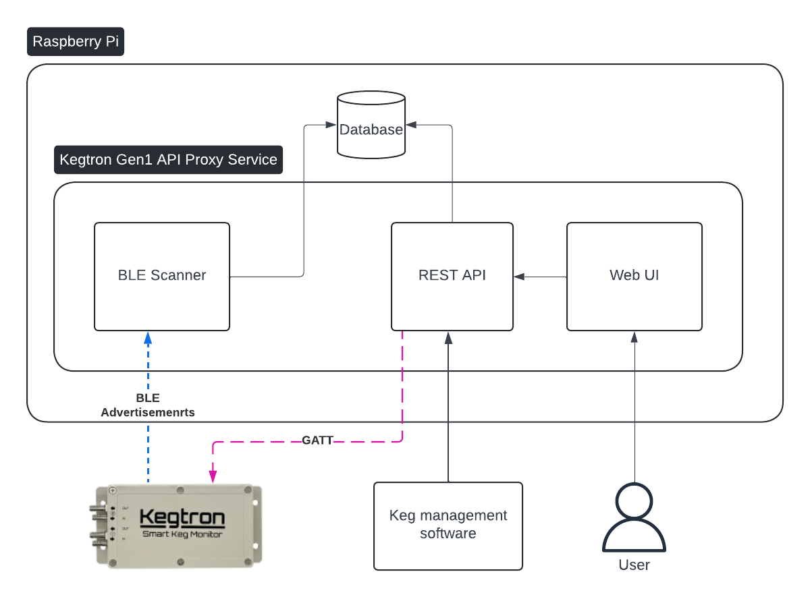
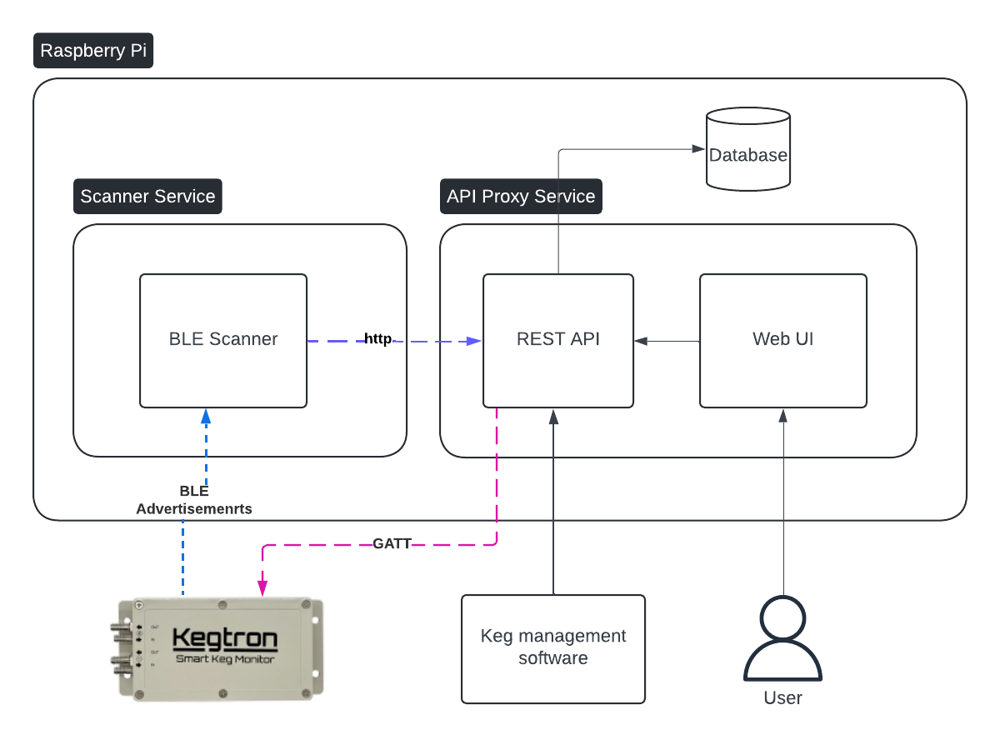

# Kegtron Gen1 API Proxy - Deployment Guide

This guide explains how to deploy the Kegtron Gen1 API Proxy on a Raspberry Pi using systemd services.

## Platform Compatibility

This software is **designed and optimized for Raspberry Pi** running Raspberry Pi OS (Debian-based). However it should be compatible with any modern OS that support BLE (Bluetooth Low Energy). The Bluetooth scanning functionality requires a Bluetooth adapter that supports BLE, which is built into Raspberry Pi 3+ models.

**Note for other platforms:** Both the scanner and API backend using the [bleak](https://github.com/hbldh/bleak) package for BLE communication.  This package is compatible with most modern operation systems. However, the software has been primarily tested on the following models running the **64bit version** of Raspberry Pi OS:

- Raspberry Pi 5
- Raspberry Pi 4

## Prerequisites

Before installing, ensure you have the following dependencies installed:

- [Python](https://python.org) 3.11+ (with dev tools)
- bluez (for other platforms see the [bleak](https://github.com/hbldh/bleak) documentation for support BLE backends)
- [Poetry](https://python-poetry.org) (v1.8) **currently not compatible with v2 or higher**
- *[optional]* vim

### Install System Dependencies

```bash
# Update package lists
sudo apt update

# Install Python 3.9+ and development tools
sudo apt install python3 python3-pip python3-venv python3-dev

# Install Bluetooth libraries (required for scanner)
sudo apt install bluetooth bluez libbluetooth-dev

# Install build essentials
sudo apt install build-essential git vim
```

### Install Poetry

This project uses Poetry for dependency management. [Install](https://python-poetry.org/docs/#installation) it using the official installer:

```bash
# Install Poetry to /usr/local/bin (it adds the "/bin")
curl -sSL https://install.python-poetry.org | sudo POETRY_HOME=/usr/local python3 -

# Add Poetry to PATH (add this to ~/.bashrc for permanent effect)
export PATH="$HOME/.local/bin:$PATH"

# Verify installation
poetry --version

# Install Poetry v1.8.5
poetry self update 1.8.5
```

## Deployment Modes

The Kegtron API Proxy supports two deployment configurations:

### 1. Default Mode (Single Service) **[Recommended]**

In this mode, both the API and scanner run as a single systemd service:

- ✅ Simplest setup and maintenance
- ✅ Scanner writes directly to the SQLite database
- ✅ Lower resource usage

**Architecture:**



### 2. Split Mode (Separate Services)

In this mode, the scanner and API run as separate services:

- ✅ More complex setup and maintenance
- ✅ Scanner communicates to the API
- ✅ Higher resource utilization but better performance for each service
- ✅ Logs for each service can be independently monitored

**Architecture:**



## Installation

Follow the guides for your specific deployment mode:

- [Default Mode](./default/INSTALL.md)
- [Split Mode](./split/INSTALL.md)

Once install you can view the up at: `http://<host ip or hostname>:8080`.

*To change your initial admin user password that was setup during installation, you can do so from the `http://<host ip or hostname>:8080/profile.html` page*

## Updating

To update to the latest in main or to a different branch/tag. \
*Make sure to check the release notes for any changes to the configuration*

``` bash
# stop the service(s)
sudo systemctl stop kegtron-api
# sudo systemctl stop kegtron-api kegtron-scanner

cd /opt/kegtron-gen1-api-proxy

git checkout main

git pull

git checkout <branch|tag>

# make sure all files are readable by the kegtron group
sudo chown -R :kegtron /opt/kegtron-gen1-api-proxy

poetry update

#restart the service(s)
sudo systemctl start kegtron-api
# sudo systemctl stop kegtron-api kegtron-scanner
```

**If you are running into issues getting the service up and running, first checkout our [troubleshooting guide](./TROUBLESHOOTING.md)**
